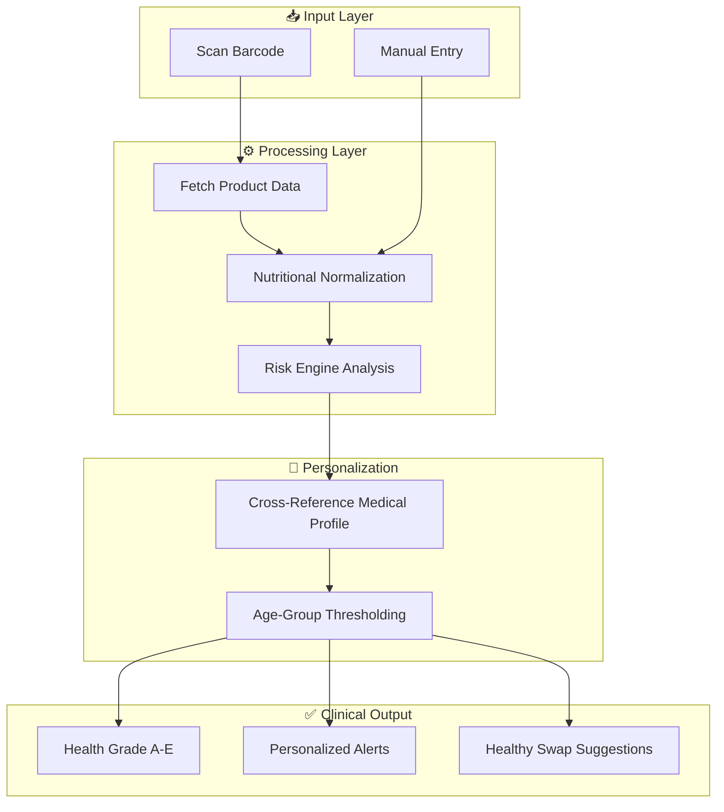

# 🥗 NutriScan: Smart Food Intelligence

[](https://reactjs.org/)
[](https://vitejs.dev/)
[](https://www.figma.com/design/wFYOlNMilBqg11MpBWax2m/first?node-id=6-12&t=jEuMUfFKnn8rHxBG-1)

**NutriScan** is a premium, clinical-grade nutritional intelligence platform. It transforms complex food labels into actionable health data, acting as a personal digital nutritionist that guards your health based on your unique medical profile.

---

## 🚀 Live Demo & Design

| Resource | Link |
| :--- | :--- |
| **🌐 Frontend Deployment** | [nutriscan-food.vercel.app](https://nutriscan-food.vercel.app/) |
| **⚙️ Backend API** | [nutriscan-6okf.onrender.com](https://nutriscan-6okf.onrender.com/) |
| **📄 API Documentation** | [Postman Collection](https://documenter.getpostman.com/view/50839854/2sBXqKofJw) |
| **🎨 Figma Design** | [View Design Prototype](https://www.figma.com/design/wFYOlNMilBqg11MpBWax2m/first?node-id=6-12&t=jEuMUfFKnn8rHxBG-1) |

---

## 🎯 Use Cases
NutriScan is built for more than just reading labels—it's a specialized tool for:
- **🧑‍⚕️ Clinical Management:** Essential for individuals managing **Diabetes, Hypertension (BP), or Obesity** who need to avoid specific nutritional triggers.
- **🛒 Smart Grocery Shopping:** Quickly decide between two products at the supermarket by identifying hidden additives and "Better Swaps."
- **🏋️ Fitness & Diet Tracking:** Monitor daily sugar and calorie footprints to stay aligned with training goals.
- **👨‍👩‍👧‍👦 Family Nutrition:** Manage multiple family profiles to ensure kids get low-sugar snacks while seniors avoid high-sodium meals.

## ✨ Visual Preview

*Featuring our new high-contrast "Clinical Curator" Emerald Theme.*

---

## 💡 How It Works: The Intelligence Flow

NutriScan uses a multi-layered analysis engine to provide deterministic health advice. Unlike generic scanners, it filters every data point through your specific medical conditions.


---

## 🔥 Core Features

### 🛡️ Medical Context Guard
The app doesn't just list numbers; it interprets them.
- **Precision Alerts:** Instantly flags high sodium for Hypertension or high sugar for Diabetics.
- **Doctor's Note Aesthetic:** High-contrast, clinical UI elements for critical warnings.
- **Family Profiles:** Switch between profiles (e.g., Kid, Senior, Adult) to get age-appropriate thresholds.

### 📊 Nutritional Blueprint (Radar Charts)
Visualize the "Balance" of your food. Our radar charts show the interplay between Protein, Fiber, Sugar, Fat, and Sodium, giving you a 360-degree view of product quality.

### 🥗 Clinical Curator's Choice
If a product fails your health test, our AI scans the database to find **Healthy Swaps**. We don't just tell you what's bad; we show you what's better.

### 📈 Daily Sugar Footprint
Track your cumulative consumption. The interactive sugar tracker converts grams into "Teaspoons" to make the impact of your diet tangible and easy to understand.

---

## 🛠️ Technology Stack

| Layer | Technologies |
| :--- | :--- |
| **Frontend** | React, Vite, Lucide-react, Chart.js, Vanilla CSS |
| **Backend** | Node.js, Express, Fuse.js (Fuzzy Search) |
| **Database** | MongoDB (Cloud), Local JSON Fallback (for 99.9% uptime) |
| **APIs** | OpenFoodFacts API, custom Risk Engine |

---

## 🚀 Getting Started

### 1. Environment Configuration
Create a `.env` file in the `backend` directory and add the following:
```env
PORT=3001
MONGO_URI=your_mongodb_connection_string
JWT_SECRET=your_super_secret_key
OPEN_FOOD_FACTS_API=https://world.openfoodfacts.org/api/v0
```

### 2. Installation & Launch

#### **Backend Setup**
```bash
cd backend
npm install
nodemon src/index.js # Runs on http://localhost:3001
```

#### **Frontend Setup**
```bash
cd frontend
npm install
npm run dev # Runs on http://localhost:5173
```

---

## 🗺️ Roadmap
- [ ] **Offline Mode:** Local database persistence for scanning without internet.
- [ ] **Meal Scanning:** Support for scanning entire plates using Computer Vision.
- [ ] **GP Integration:** Export monthly health logs to PDF for medical consultations.

Developed with ❤️ for a Healthier World.