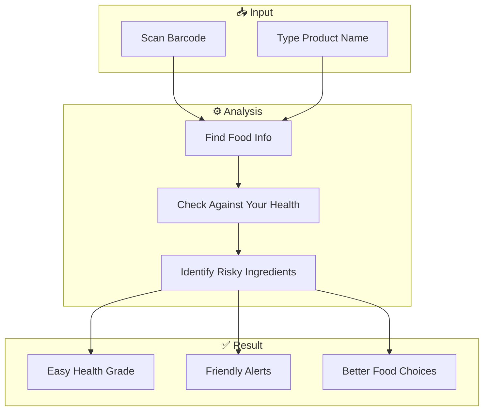

# 🥗 NutriScan: Your Smart Food Guide

[](https://reactjs.org/)
[](https://vitejs.dev/)
[](https://www.figma.com/design/wFYOlNMilBqg11MpBWax2m/first?node-id=6-12&t=jEuMUfFKnn8rHxBG-1)

**NutriScan** is a simple but powerful tool that helps you understand what's inside your food. Think of it as a pocket guide that tells you if a snack is good for you, based on your own health needs.

---

## 🚀 Quick Links

| Resource | Link |
| :--- | :--- |
| **🌐 Frontend Deployment** | [nutriscan-food.vercel.app](https://nutriscan-food.vercel.app/) |
| **⚙️ Backend API** | [nutriscan-6okf.onrender.com](https://nutriscan-6okf.onrender.com/) |
| **📄 API Documentation** | [Postman Collection](https://documenter.getpostman.com/view/50839854/2sBXqKofJw) |
| **🎨 Figma Design** | [View Design Prototype](https://www.figma.com/design/wFYOlNMilBqg11MpBWax2m/first?node-id=6-12&t=jEuMUfFKnn8rHxBG-1) |
| **📺 YouTube Video** | [View Video](https://www.youtube.com/watch?v=2H2T3d6530kqw) |

---

## ✨ See it in Action

*Our clean and easy-to-use health dashboard.*

---

## 📂 Project Structure

Here is how the project is organized:

```text
nutriscan/
├── backend/                # The "Brain" of the app
│   ├── src/
│   │   ├── controllers/    # Handles requests (Login, Scan, History)
│   │   ├── models/         # Database structures (User, Product)
│   │   ├── services/       # Smart logic (Health scores, Risk checks)
│   │   └── data/           # Local list of common foods
│   └── index.js            # Starts the backend server
├── frontend/               # The "Face" of the app (what you see)
│   ├── public/             # Images and static files
│   └── src/
│       ├── components/     # Building blocks (Scanner, Charts, Profile)
│       ├── App.jsx         # Main app layout
│       └── main.jsx        # Entry point for the website
└── README.md               # This guide!
```

---

## 💡 How It Works

NutriScan makes complex food labels easy to understand in three simple steps:



---

## 🔥 Main Features

### 🛡️ Personalized Health Alerts
Instead of just showing random numbers, the app tells you exactly how a food item affects **you**. If you have high blood pressure, it flags high salt. If you're managing sugar, it warns about hidden sweets.

### 📊 Simple Health Grades
Every product gets a simple grade from **A to E**. We also show a "Health Radar" chart so you can see at a glance if it's high in protein or too high in fat.

### 🥗 Better Choice Suggestions
If a snack isn't great for you, NutriScan doesn't just say "no." It suggests a **Healthier Swap**—something similar but better for your body.

---

## 🛠️ Tech Stack

Our app is built using modern, reliable technologies:

- **Frontend:** React.js, Vite (for speed), Lucide-react (icons), Chart.js (for health charts).
- **Backend:** Node.js, Express (the server engine), Fuse.js (for smart food searching).
- **Database:** MongoDB (to store your profiles and scan history).
- **Data Source:** Open Food Facts (global food database).

---

## 🎯 Who is it for?
- **Health Conscious:** Anyone managing Diabetes, BP, or weight.
- **Smart Shoppers:** People who want to make better choices at the grocery store.
- **Families:** Track the nutrition for your whole family in one place.

---

## 🚀 Setup Guide

### 1. Simple Configuration
Create a `.env` file in the `backend` folder and add your keys:
```env
PORT=3001
MONGO_URI=your_mongodb_connection_string
JWT_SECRET=your_super_secret_key
OPEN_FOOD_FACTS_API=https://world.openfoodfacts.org/api/v0
```

### 2. Run the App

**For the Backend:**
```bash
cd backend
npm install
nodemon src/index.js # Runs on http://localhost:3001
```

#### **Frontend Setup**
```bash
cd frontend
npm install
npm run dev # Runs on http://localhost:5173
```

---

Developed with ❤️ for a Healthier You.